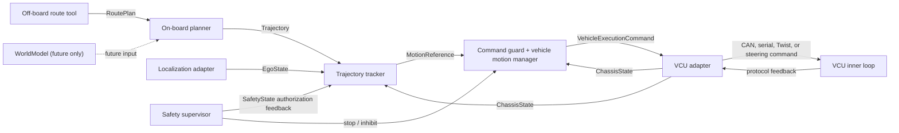

# AUTO_ROVER Architecture

AUTO_ROVER is a monorepo that first proves one complete known-map navigation
loop on a real vehicle. Its autonomy layers are perception, planning, and
control. Safety and vehicle integration support those layers without becoming
additional autonomy layers.

## Phase-1 system

The deployed phase-1 path is:

`RoutePlan -> Trajectory -> MotionReference -> Command guard + vehicle motion manager -> VehicleExecutionCommand -> VCU adapter -> VCU`.

`EgoState`, normalized `ChassisState`, and the software supervisor's
`SafetyState` authorization feedback close the loop.  A non-armed safety mode
holds a valid zero reference and resets the tracker ramp; missing, stale, or
invalid safety feedback fails closed.  This software authorization never
fabricates VCU enable feedback.  The tracker never emits a vendor protocol
frame, and the adapter never receives unchecked tracker output.

## Scope and boundaries

Known-map navigation accepts an off-board `RoutePlan` and creates an executable,
forward/reverse-capable `Trajectory` on board. It has no world model, online
obstacle detection, local avoidance, online replanning, or task manager. Field
coverage and autonomous exploration are separately designed future applications;
each will own its own bringup and deployment configuration while reusing stable
contracts where appropriate.

Phase 1 uses Ubuntu 20.04, ROS 1 Noetic, catkin, roscpp wrappers, launch files,
and tf2. No empty ROS or ROS 2 packages are maintained. A ROS 2 migration is
native and follows validation of the first platform.

## Core first; ROS at the edge

`auto_rover_core` owns middleware-independent domain types, validation helpers,
and geometry primitives. Planning, control, and vehicle core libraries consume
those types and injected time/configuration; they do not include ROS headers or
own ROS nodes, TF listeners, publishers, parameters, or logging.

`auto_rover_interfaces` owns ROS 1 messages, services, and actions only.
`auto_rover_ros1_conversions` explicitly maps those messages to and from core
types, and thin ROS 1 wrappers own graph-facing concerns. Future ROS 2 wrappers
reuse the core semantics rather than adding conditional ROS-version code.

The initial contracts are `EgoState`, `RoutePlan`, `Trajectory`,
`MotionReference`, `ChassisState`, `VehicleProfile`, `SafetyState`, and
`EmergencyStop`. Every public contract declares its frame, units, timestamp,
validity, timeout, sign conventions, and failure semantics.

## Guarded vehicle execution

`Command guard + vehicle motion manager` has two logical responsibilities. The
command guard validates freshness, declared validity, limits, capabilities, and
safety state, then constrains `MotionReference`. The vehicle motion manager
produces middleware-independent `VehicleExecutionCommand` with limited signed
speed, curvature, motion-enable state, hold mode, sequence ID, and local
deadline. A required discrete shift is a separate, state-checked `GearRequest`.

Every `VehicleProfile` selects exactly one direction capability policy:

- `SIGNED_SPEED_DIRECTION`: the VCU uses signed speed and has no separate gear operation.
- `CONFIRMED_GEAR_DIRECTION`: autonomous direction changes require a separate gear request and fresh, matching gear feedback.

Both policies require valid measured speed below the configured shift threshold;
encoder feedback is preferred. Missing or stale gear confirmation, unsupported
capabilities, and invalid required input fail closed. A profile may not silently
fall back from confirmed-gear control to signed-speed control.

## Safety ownership

Software emergency stop is an explicit independent path, latched by the safety
supervisor and command guard until an authorized reset after conditions clear;
it never auto-recovers and is not a field in `MotionReference`. The physical
vehicle E-stop is a separate hardware safety chain. Software must not replace or
weaken it.

There are dual watchdog boundaries. The command guard checks upstream message
age and `valid_for` with a monotonic receiver watchdog. Independently, the VCU
adapter checks each `VehicleExecutionCommand` age and local deadline and runs an
output watchdog that maps expiry to the configured VCU safe state. A hardware or
firmware VCU watchdog is used where available. Staleness at either boundary is
rejected; normal timeout recovery requires a configured run of fresh commands.

For detailed semantics, including state definitions, transforms, rates, and
acceptance evidence, see the [approved architecture baseline](docs/superpowers/specs/2026-08-10-auto-rover-architecture-design.md).
