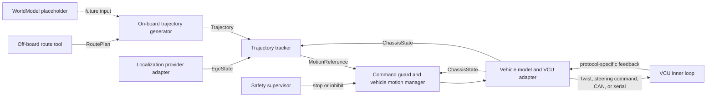

# AUTO_ROVER Architecture Design Baseline

- Status: approved in discussion and written review
- Date: 2026-08-10
- Initial runtime: Ubuntu 20.04 + ROS 1 Noetic
- Future runtime: a native ROS 2 implementation on a supported ROS 2 LTS
- Repository: `niuma-phd/AUTO_ROVER`

## 1. Decision summary

AUTO_ROVER starts as a monorepo and develops one complete real-vehicle loop
before extracting independently releasable modules. Its top-level algorithmic
architecture is perception, planning, and control. Vehicle integration, safety,
interfaces, configuration, and testing support those three layers but are not
additional autonomy layers.

The first application is known-map navigation. It receives an off-board
`RoutePlan`, converts it into an executable `Trajectory`, tracks that trajectory,
and sends a vehicle-independent motion reference to a vehicle-specific adapter.
Environment modelling and local obstacle avoidance are documented extension
points only in phase 1.

Each deployed application is single-purpose. Known-map navigation, autonomous
exploration, and field coverage have separate bringup and deployment
configurations; AUTO_ROVER will not add a runtime task manager merely to switch
one vehicle process between those applications.

ROS 1 Noetic is the only phase-1 runtime. The project does not maintain empty
ROS 2 packages or two live middleware implementations from day one. Core
algorithms and domain semantics are kept independent of ROS APIs so that a
native ROS 2 wrapper can be added after the first platform is validated.

## 2. Goals and non-goals

### 2.1 Goals

- Close a repeatable known-map navigation loop on the Ubuntu 20.04 / Noetic
  test platform.
- Allow localization providers, trajectory generators, tracking controllers,
  vehicle models, and VCU protocols to be replaced behind stable contracts.
- Use both `EgoState` and normalized `ChassisState` feedback instead of relying
  only on LIO pose.
- Preserve an existing VCU's encoder-level inner loop when it already accepts
  target speed or steering commands.
- Make configuration vehicle-dependent at deployment time rather than hard-code
  one wheelbase, limit set, steering convention, or VCU protocol.
- Keep core behavior deterministic and testable without a live ROS graph or
  physical vehicle.
- Prepare for a native ROS 2 implementation without paying the cost of a dual
  stack during phase 1.

### 2.2 Phase-1 non-goals

- A multi-application mission or task manager.
- Online environment modelling, obstacle detection, or local avoidance.
- Online frontier exploration.
- Full field-coverage planning on the vehicle.
- Recreating Nav2 or importing all of Autoware.
- Supporting every vehicle model in one running deployment.
- Replacing a functioning VCU inner speed loop with a duplicate controller.

## 3. System context and data flow



The logical control loop is:

```text
Trajectory + EgoState + ChassisState
    -> TrajectoryTracker
    -> MotionReference
    -> CommandGuard / VehicleMotionManager
    -> VCUAdapter
    -> VCU inner loop
```

`CommandGuard` and `VehicleMotionManager` are logical components. They can live
inside `auto_rover_safety` and `auto_rover_vehicle` in phase 1; the design does
not require a ROS package or process for every box.

## 4. Application model

### 4.1 Known-map navigation — phase 1

- A workstation or route tool prepares `RoutePlan` before deployment.
- The vehicle loads or receives that plan.
- On-board planning performs `RoutePlan -> Trajectory` only.
- The controller tracks the trajectory without local obstacle avoidance.
- The vehicle and safety modules execute, validate, and supervise commands.

### 4.2 Autonomous exploration — later

Exploration is the explicit exception to off-board route generation. It will
eventually add online environment modelling, frontier or goal selection, and
online replanning. Those modules will feed the same `Trajectory` contract and
will not change the controller or VCU boundary.

### 4.3 Field coverage — later

Coverage and headland planning are initially off-board. The resulting route is
uploaded as `RoutePlan`; on-board planning and control reuse the same contracts.

Each application owns its own bringup, parameter overlays, and acceptance
scenarios. Shared algorithms are referenced, not copied into application code.

## 5. Module boundaries

### 5.1 Interfaces

`auto_rover_interfaces` contains ROS messages, services, and actions only. It
contains no algorithm nodes. Every contract documents frame, timestamp, unit,
sign convention, validity, timeout, and failure semantics.

The middleware-independent C++ value types that carry the same domain semantics
belong to `auto_rover_core`. That library contains only stable value types,
validation helpers, and common geometry primitives; it contains no ROS headers,
nodes, or application logic. ROS 1 wrappers convert explicitly between
`auto_rover_interfaces` messages and the core types through
`auto_rover_ros1_conversions`. Algorithm cores consume the core types, never ROS
messages. A future ROS 2 conversion library can therefore reuse the algorithm
cores without conditional ROS-version code.

The initial semantic contract set is:

- `EgoState`: normalized vehicle pose, velocity, covariance, source, and
  validity.
- `RoutePlan`: an off-board route or mission path supplied to the vehicle.
- `Trajectory` and `TrajectorySegment`: executable points, speed constraints,
  and forward/reverse segment direction.
- `MotionReference`: vehicle-independent requested motion.
- `ChassisState`: normalized VCU feedback with explicit validity flags.
- `VehicleProfile`: a versioned configuration schema and domain object for the
  kinematic model, geometry, capabilities, and limits; it is not required to be
  a continuously published ROS message.
- `SafetyState` and `EmergencyStop`: supervisory state and independent stop
  semantics.
- `WorldModel`: a reserved name and documented boundary only. Its ROS message
  is not frozen until the environment-modelling design is approved.

ROS 1 `Header.seq` is not a semantic identifier. Trajectories and commands that
need identity use explicit IDs. After a v1 ROS message is published, a semantic
or field-layout break produces a V2 type and converter instead of silently
changing the ROS 1 MD5 contract.

### 5.2 Perception

Perception has two conceptual outputs:

1. self state estimation, exposed as `EgoState`;
2. an environment model, reserved for a later phase.

FAST-LIVO2, LIO-Livox, future Ultra-Fusion, and dual-antenna RTK with IMU and
wheel information are providers behind localization adapters. AUTO_ROVER does
not copy those upstream implementations into its core packages. An adapter
normalizes their output and declares source health and validity.

The phase-1 repository contains `auto_rover_localization` but no empty ROS
package pretending to implement a world model.

### 5.3 Planning

Phase-1 on-board planning accepts `RoutePlan` and `VehicleProfile` and emits a
kinematically feasible `Trajectory`. It does not consume live obstacles and does
not locally replan.

Planner implementations are replaceable behind the same input and output
contracts. A planner never depends on the concrete FAST-LIVO2 package, a VCU
protocol, or an application bringup package.

### 5.4 Control

The trajectory tracker consumes `Trajectory`, `EgoState`, available fields from
`ChassisState`, and `VehicleProfile`. It emits a `MotionReference`, not a CAN
frame, pedal percentage, or vendor-specific message.

The phase-1 semantic content of `MotionReference` is:

```text
header.stamp
direction                 # FORWARD or REVERSE
target_speed_mps           # non-negative magnitude
target_curvature_inv_m     # 1/m; positive means steering left
valid_for                  # duration declared by the sender
```

`header.frame_id` names the configured vehicle control frame. For the phase-1
Ackermann profile, that frame is centred at the rear axle with x forward, y
left, and z up. Localization is transformed to that frame before tracking, and
curvature is defined at that reference point. Other vehicle models may select a
different control frame explicitly in `VehicleProfile`.

Target acceleration, jerk, and curvature rate are added only when a controller
or VCU can use them. They are not required placeholders in v1.

For direction sign `d` (`+1` forward, `-1` reverse), target speed magnitude `s`,
wheelbase `L`, and curvature `kappa`:

```text
signed_velocity = d * s
steering_angle  = atan(L * kappa)
yaw_rate        = signed_velocity * kappa
```

The `steering_angle` equation above is specifically the single-track Ackermann
conversion for a rear-axle control point. Another vehicle model or control point
must provide its own conversion and must not reuse that equation implicitly.

When reversing with the wheels still steered left, `kappa` remains positive;
the negative signed velocity makes yaw rate negative. The adapter does not
silently invert curvature a second time.

A body-Twist adapter therefore produces:

```text
linear.x  = signed_velocity
angular.z = signed_velocity * target_curvature
```

This mapping is an adapter policy, not the AUTO_ROVER internal contract. At
zero speed, a Twist loses a non-zero pre-steering request because yaw rate is
zero, while `MotionReference` retains the target curvature. Adapters must also
declare whether a field named `angular.z` means body yaw rate or direct steering
angle; ROS packages have used both conventions.

### 5.5 Vehicle integration

`auto_rover_vehicle` owns vehicle profiles, kinematic conversions, capability
checks, rate and range limits, direction changes, and parking behavior.
Protocol-specific adapters own unit conversion, sign conversion, serialization,
checksums, CAN or serial I/O, and vendor diagnostics.

The command path uses two internal, middleware-independent stages. The command
guard validates freshness and safety inputs and produces a constrained
`MotionReference`. The vehicle motion manager then produces a
`VehicleExecutionCommand` containing the limited signed speed, curvature,
motion-enable state, hold mode, sequence ID, and local deadline. If the vehicle
requires a discrete transmission operation, the manager also produces a
separately state-checked `GearRequest`. These are vehicle-layer domain types,
not frozen public ROS messages. The VCU adapter serializes them; it never receives
an unchecked tracker output directly.

The first adapter may output `/cmd_vel` if that is the selected VCU's contract.
Future adapters may output steering angle plus speed, wheel speeds, direct
curvature, or vendor messages. `/cmd_vel` is never assumed to be the universal
internal command.

Changing from forward to reverse is stateful:

```text
decelerate
-> confirm measured speed is below the configured threshold
-> apply configured hold behavior
-> request direction or gear change
-> confirm the requested vehicle direction by the configured capability policy
-> release hold
-> ramp speed
```

`MotionReference.direction` is motion intent, not a D/R/N/P transmission state.
Every `VehicleProfile` must declare exactly one supported direction capability:

- `SIGNED_SPEED_DIRECTION`: the VCU contract uses signed speed and has no
  independent gear operation; or
- `CONFIRMED_GEAR_DIRECTION`: the VCU requires an independent gear request and
  valid, matching gear feedback before hold can be released.

For the second capability, missing or stale gear confirmation prohibits
autonomous direction changes and fails closed. A profile cannot silently fall
back from confirmed gear control to signed-speed control. Both policies require
valid measured speed below the configured shift threshold; VCU encoder feedback
is preferred over LIO velocity. The first real VCU profile is chosen only after
its protocol and feedback behavior have been audited.

### 5.6 Chassis feedback and closed-loop ownership

The common `ChassisState` subset starts with:

```text
stamp
measured_speed
steering_tire_angle
gear_state
control_enabled
fault_state
valid_mask
```

`measured_speed` is signed longitudinal velocity in metres per second in the
configured control frame. `steering_tire_angle` is the virtual single-track
front-tire angle in radians, positive left; an adapter that cannot convert its
wheel or steering-wheel measurement to that semantic marks the field invalid.
Normalized gear values are `UNKNOWN`, `PARK`, `REVERSE`, `NEUTRAL`, `DRIVE`,
`LOW`, and `OTHER`. `control_enabled` means the VCU has accepted autonomous
control, not merely that a command was published. Normalized fault values are
`UNKNOWN`, `OK`, `DEGRADED`, `FAULT`, and `ESTOP`; vendor-specific codes remain
in diagnostics. `valid_mask` has one documented bit per optional field, and
message age can invalidate the entire state even when individual bits are set.

Every VCU adapter publishes only fields it can substantiate and marks missing
fields invalid. Wheel speeds, currents, temperatures, battery data, and vendor
fault codes may remain in adapter diagnostics until a cross-vehicle semantic
need is demonstrated.

When a VCU accepts target speed and already closes the encoder loop, AUTO_ROVER
does not add another controller at the same bandwidth. The trajectory tracker
uses feedback for path tracking, lookahead, validation, and fault detection;
the vehicle manager uses it for limiting, stop confirmation, and safe direction
changes. A separate low-level longitudinal or steering controller is introduced
only for a VCU that exposes actuator-level inputs such as torque, voltage,
throttle, or brake pressure.

### 5.7 Safety

Normal deceleration is represented by a decreasing speed reference. Parking
hold is a vehicle policy. An explicit software emergency stop is an independent
path, is latched by the safety supervisor and command guard, and remains active
until an authorized reset after the triggering conditions have cleared. It is
not a boolean inside `MotionReference` and never auto-recovers. A physical
vehicle emergency-stop circuit is a separate hardware safety chain; ROS software
does not replace or weaken it.

The command guard validates upstream message age and `valid_for` and maintains a
monotonic receiver watchdog. ROS time alone is insufficient because it can jump
during replay or simulation. The VCU adapter independently validates the age and
local deadline of each `VehicleExecutionCommand`, maintains its own output
watchdog, and maps expiry to the VCU's configured safe state. A hardware or
firmware VCU watchdog is used when available. A stale command at either boundary
is rejected. Recovery from an ordinary communication timeout requires a
configured number of fresh commands; only the authorized emergency-stop reset
path can clear a software emergency-stop latch.

Autonomous command output is inhibited until required localization, trajectory,
VCU state, and safety inputs are fresh and valid. Limits and unsupported vehicle
capabilities fail closed and produce diagnostics.

## 6. ROS 1 first, native ROS 2 later

Phase 1 uses catkin, roscpp wrappers, ROS 1 launch files, and tf2 on Ubuntu 20.04
/ Noetic. `rospy` is suitable for tools or orchestration that do not host a C++
algorithm core; a Python wrapper around a core requires an explicit binding
layer. No core algorithm directly owns a `ros::NodeHandle`, ROS publisher, TF
listener, parameter-server lookup, or ROS logging macro.

Inside each algorithm package:

- the core library accepts domain objects, configuration structs, and an
  injected time value;
- the ROS 1 wrapper performs message conversion, TF lookup, parameter loading,
  publication, subscription, and diagnostics;
- configuration is loaded once and passed into the core rather than queried
  from arbitrary global parameter names during computation;
- topic names are relative and remappable;
- core code contains no ROS-version preprocessor branches.

The ownership and conversion direction are therefore:

```text
auto_rover_core domain types -> planning/control/vehicle core libraries
auto_rover_interfaces ROS 1 messages + auto_rover_core
    -> auto_rover_ros1_conversions
algorithm core + ROS 1 conversions -> thin ROS 1 node wrapper
```

The future native ROS 2 implementation reuses the core and semantic contracts
and adds rclcpp, ROS 2 messages, QoS, lifecycle, launch, and executor-specific
wrappers. `ros1_bridge` may support migration tests but is not a permanent
runtime dependency. The exact ROS 2 distribution is selected when migration
starts so that it is still supported at that time.

Because Noetic and Ubuntu 20.04 are past standard support, the Noetic toolchain,
base image, apt dependencies, and upstream source SHAs are pinned. Networked
deployment must account for the lack of normal Noetic security maintenance.

## 7. Monorepo layout

The intended repository layout is:

```text
AUTO_ROVER/
├── README.md
├── ARCHITECTURE.md
├── ROADMAP.md
├── AGENTS.md
├── CONTRIBUTING.md
├── LICENSE
├── docs/
│   ├── architecture/
│   ├── interfaces/
│   ├── modules/
│   ├── vehicles/
│   ├── applications/
│   ├── adr/
│   └── testing/
├── src/
│   ├── core/auto_rover_core/
│   ├── interfaces/
│   │   ├── auto_rover_interfaces/
│   │   └── auto_rover_ros1_conversions/
│   ├── perception/auto_rover_localization/
│   ├── planning/auto_rover_planning/
│   ├── control/auto_rover_control/
│   ├── vehicle/
│   │   ├── auto_rover_vehicle/
│   │   └── adapters/auto_rover_vcu_<protocol>/
│   ├── safety/auto_rover_safety/
│   └── apps/
│       ├── known_map_navigation/auto_rover_known_map_bringup/
│       ├── autonomous_exploration/
│       └── field_coverage/
├── tools/
│   ├── route_tools/
│   ├── bag_tools/
│   └── visualization/
├── dependencies/
│   └── known_map.repos
├── tests/
│   ├── integration/
│   ├── replay/
│   ├── fixtures/
│   └── scenarios/
├── deploy/
│   ├── scripts/
│   ├── docker/
│   └── system/
└── .github/
    ├── workflows/
    ├── ISSUE_TEMPLATE/
    └── PULL_REQUEST_TEMPLATE.md
```

Only phase-1 packages are created initially. Future application directories and
placeholder module documentation may exist, but empty ROS packages do not.

The dependency direction is fixed:

```text
auto_rover_core -> algorithm core libraries
auto_rover_core + auto_rover_interfaces -> ROS 1 conversions and wrappers
algorithm cores + ROS 1 wrappers -> application bringup and integration
```

Lower-level packages never depend on an application. Planning never depends on
a localization implementation. Control never depends on a VCU protocol package.
A VCU adapter contains no trajectory tracking algorithm.

## 8. Open-source adoption policy

AUTO_ROVER reuses narrowly scoped packages or algorithms only after checking
interface fit, maintenance state, target ROS version, and license. Third-party
source is not copied wholesale into the monorepo; dependencies are pinned to a
tag or SHA in `.repos` files and connected through thin adapters.

- Autoware is the primary architecture reference for trajectory following,
  command gating, vehicle interfaces, independent gear commands, and normalized
  feedback. The full stack is not a phase-1 dependency.
- `ackermann_msgs` can be supported at an Ackermann adapter boundary, but it is
  not the cross-vehicle internal contract.
- ROS 1 `ros_control` or later `ros2_control` is adopted only when a VCU maps
  naturally to command and state interfaces such as drive velocity and steering
  position. It is not forced over an existing vehicle-level speed loop.
- Dataspeed ULC/DBW is a reference for speed/curvature modes, enable and timeout
  semantics, and feedback reports. Its vendor messages do not become AUTO_ROVER
  public interfaces.
- FAST-LIVO2, LIO-Livox, RTK drivers, and future localization algorithms remain
  external implementations behind adapters.

The project license must be selected before copying or modifying third-party
source. Until that governance decision is recorded, phase-1 work is limited to
original code, interface design, and external dependencies used under their own
licenses.

## 9. Testing and CI strategy

Phase-1 CI has five layers:

1. build and unit-test middleware-independent core libraries without ROS;
2. build the Noetic workspace in a pinned Ubuntu 20.04 environment;
3. run contract, configuration-schema, lint, and dependency-direction checks;
4. replay recorded inputs and test deterministic controller outputs;
5. run integration tests with fake localization and a fake VCU, including stale
   data, command timeout, stop, and direction-change scenarios.

A newer compiler may build the pure core as a migration sentinel after the
first test-platform loop is established; it is not a phase-1 vehicle-validation
prerequisite. Native ROS 2 CI is added only when the ROS 2 implementation begins.
Hardware-in-the-loop tests are added for each VCU adapter before that adapter is
considered independently releasable.

System acceptance records the vehicle profile, dependency SHAs, parameters,
route fixture, bag data, observed tracking metrics, and safety outcomes. Each
real-vehicle milestone must include a versioned `acceptance_profile` before the
test is run. It provides numeric values for at least: run count, route-completion
rate, lateral and heading error, command frequency and maximum age, stale-input
response time, stopping time and distance, direction-change speed threshold,
and hold-release conditions. Exact values are vehicle- and scenario-specific,
but the profile's presence and successful results are phase deliverables.

## 10. Phase-1 delivery boundary

Phase 1 is complete when the selected Ackermann test vehicle can:

1. load a known-map `RoutePlan` generated off-board;
2. receive fresh `EgoState` from one localization adapter;
3. generate and validate a forward/reverse-capable `Trajectory`;
4. track it and emit fresh `MotionReference` commands;
5. convert those commands through one real VCU adapter;
6. normalize the available VCU feedback into `ChassisState`;
7. stop safely on stale command, invalid required input, VCU fault, or explicit
   emergency stop; and
8. reproduce the core behavior in replay and fake-VCU integration tests.

All eight outcomes must meet the committed vehicle/scenario
`acceptance_profile`; words such as fresh, repeatable, and safe are not used as
unmeasured substitutes. A fake VCU can validate the architecture before the
real protocol audit, but completion of item 5 and the real-vehicle milestone
requires that audit and a capability profile that fails closed.

No claim of obstacle avoidance, autonomous exploration, or universal vehicle
support is made at this milestone.

## 11. GitHub workflow and future repository split

`main` is the integration baseline. Human feature work uses `feat/*`, fixes use
`fix/*`, experiments use `exp/*`, and automated agent work may use `agent/*`.
Changes are merged by pull request after relevant CI, with squash merge as the
default. Public interface changes require an ADR and explicit compatibility
review.

AUTO_ROVER remains the application integration, deployment, dependency-BOM, and
system-acceptance repository unless a later ADR revises that role. Empty future
repositories are not created. The following repository names are proposed and
reserved for an extraction ADR when the criteria below are met:

- `auto-rover-interfaces`
- `auto-rover-perception`
- `auto-rover-planning`
- `auto-rover-control`
- `auto-rover-vehicle`
- optional `auto-rover-tools`
- optional `auto-rover-safety`

A module is extracted only when its interface is stable across at least two
system releases, it builds and tests independently, most recent changes do not
require synchronized edits elsewhere, and it has an independent consumer,
maintainer, or release cadence. World modelling is not extracted while it is a
placeholder; vehicle integration is not extracted merely for one VCU; planning
and control are not separated while they still require frequent coupled API
changes.

Component repositories use semantic versioning. Breaking message, service, or
action changes require a major version. An AUTO_ROVER release pins component
and third-party tags or SHAs in a BOM, and release order follows interfaces,
components, then system integration acceptance.

## 12. Explicit decision gates

The following choices are intentionally made when their required evidence is
available; they do not block the architecture baseline:

- The first VCU adapter name and exact fields are chosen after its protocol and
  feedback documentation are audited.
- The first tracking algorithm is selected by replay and test-platform results;
  the interface does not assume Pure Pursuit, Stanley, MPC, or another method.
- The native ROS 2 target distribution is selected after phase-1 validation,
  using a ROS 2 LTS that is supported at migration time.
- Environment modelling and local avoidance receive their own design before
  implementation.
- The public source license is selected before third-party source is copied or
  modified.

## 13. Primary design references

- [Autoware control component design](https://autowarefoundation.github.io/autoware-documentation/main/design/autoware-architecture-v1/components/control/)
- [Autoware vehicle interface](https://autowarefoundation.github.io/autoware-documentation/main/design/autoware-architecture-v1/interfaces/components/vehicle-interface/)
- [ROS `ackermann_msgs`](https://github.com/ros-drivers/ackermann_msgs)
- [ROS 1 Noetic Ackermann steering controller](https://github.com/ros-controls/ros_controllers/tree/noetic-devel/ackermann_steering_controller)
- [ROS 2 steering controller library](https://control.ros.org/master/doc/ros2_controllers/steering_controllers_library/doc/userdoc.html)
- [Dataspeed ULC](https://bitbucket.org/DataspeedInc/dataspeed_ulc_ros/src/master/)
- [ROS 1 to ROS 2 package migration guide](https://docs.ros.org/en/kilted/How-To-Guides/Migrating-from-ROS1/Migrating-Packages.html)
- [ROS 1 bridge documentation](https://docs.ros.org/en/humble/p/ros1_bridge/)
